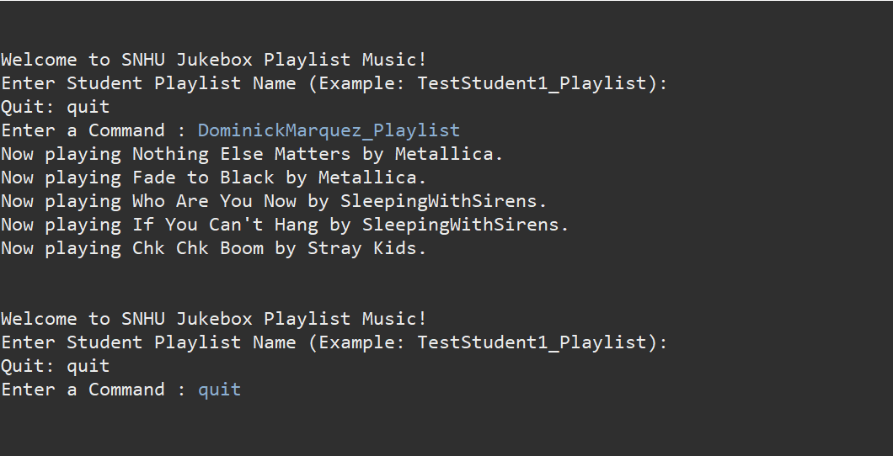
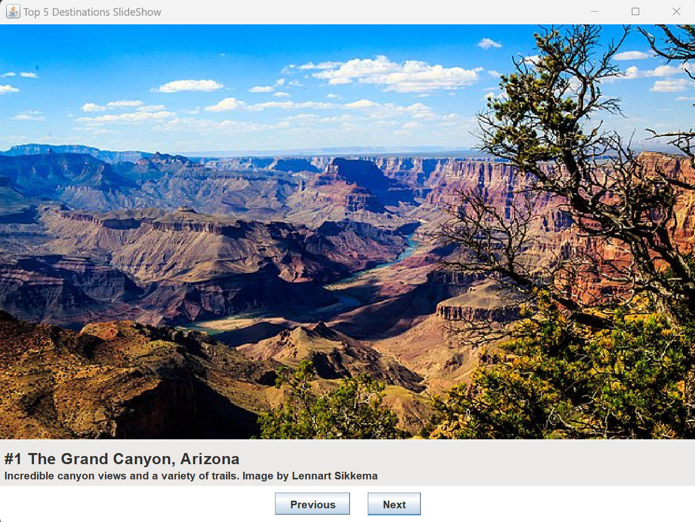
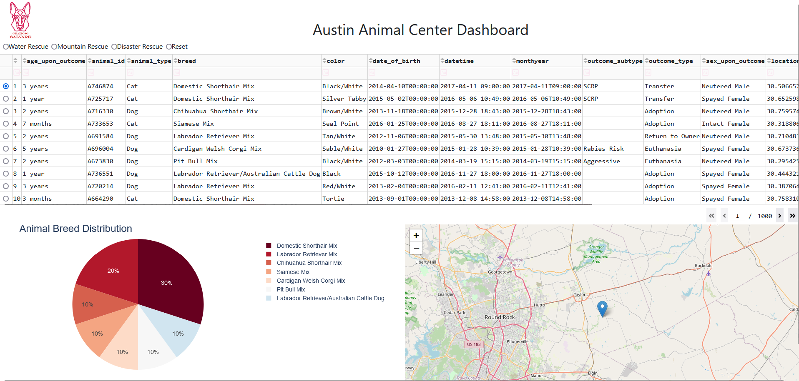

## Professional Self-Assessment
Throughout my Computer Science program, the coursework and the development of this ePortfolio have been instrumental in showcasing my strengths, shaping my professional goals and values, and preparing me for a successful career in the field. The rigorous curriculum at Southern New Hampshire University has provided me with a solid foundation in core computer science principles.

My experience collaborating in a team environment has been invaluable.  In my CS-310 Collaboration and Team Project course, developing the jukebox playlist application required effective communication, task delegation, and conflict resolution within a team setting.  This experience not only honed my technical abilities but also emphasized the importance of teamwork in software development. Communicating effectively with stakeholders is crucial in any software development role.  Throughout the program, I have practiced this skill through presentations, project reports, and code reviews.  For instance, presenting project proposals in CS-250 Software Development Lifecycle and explaining technical concepts to non-technical audiences in CS-255 System Analysis and Design honed my communication skills. Furthermore, the process of gathering requirements and presenting design solutions for the AAC Dashboard in CS-340 Client/Server Development reinforced the importance of clear and concise communication with stakeholders to ensure project success.

A strong understanding of data structures and algorithms is fundamental to computer science. My coursework has provided extensive experience with various data structures, including linked lists and hash maps. Implementing these structures in projects like the jukebox playlist application and the vacation booking slideshow has solidified my understanding of their practical applications. Software engineering principles and database management are also critical components of software development. The software development lifecycle was a recurring theme throughout the SNHU Computer Science program. I learned requirements gathering and design, implementation and testing, and how to deploy applications. Working with databases, particularly MongoDB for the Austin Animal Center (AAC) Dashboard, has provided hands-on experience in data modeling, querying, and database administration.

This ePortfolio showcases a range of projects that demonstrate my technical skills and abilities. The jukebox playlist application, developed in a team setting, highlights my collaboration skills and proficiency in Java. The vacation booking slideshow demonstrates my understanding of object-oriented principles, UI design, and data structures in Java. Finally, the Austin Animal Center Dashboard showcases my ability to develop interactive web applications, work with databases, and apply data visualization techniques using Python, Dash, and MongoDB. These projects, taken together, provide a comprehensive picture of my skills and experience in computer science.

## Code Review
My approach to the code review involved a structured process of analysis and planning for the three artifacts. First, I provided a detailed walkthrough of the existing code's features and functionality, explaining how it worked before any enhancements. This established a clear baseline for understanding the project. Next, I conducted a thorough code analysis, targeting areas for improvement across various aspects, including code structure, logic, efficiency, functionality, security, testing, commenting, and documentation.  This analysis formed the basis for my planned enhancements. This comprehensive approach ensured that the code review not only served as a plan for improvement but also as a demonstration of my understanding of software development principles and course objectives.

<code>Access the code review <a href="">here</a>.</code>

## Artifact 1: Software Engineering and Design Category
### Jukebox Playlist

<code>Access the Artifact 1 Narrative <a href="https://myappsngames.github.io/artifact1">here</a>.</code>

## Artifact 2: Algorithms and Data Structure Category
### Top 5 Destinations Slide Show

<code>Access the Artifact 2 Narrative <a href="https://myappsngames.github.io/artifact2">here</a>.</code>

## Artifact 3: Databases Category
### Austin Animal Center Dashboard

<code>Access the Artifact 3 Narrative <a href="https://myappsngames.github.io/artifact3">here</a>.</code>

